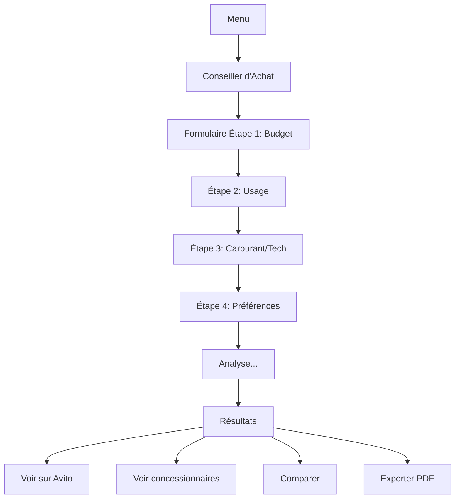

# Conseiller d'Achat Automobile - Plan d'Implémentation

## Description

Ajout d'un module **"Conseiller d'Achat"** qui aide les utilisateurs à choisir leur prochaine voiture selon leurs besoins et budget, avec des liens directs vers les plateformes de vente au Maroc.

### Objectif

Transformer AutoManager en un assistant complet qui :
1. **Guide** l'utilisateur dans le choix d'un véhicule
2. **Analyse** ses besoins selon plusieurs critères
3. **Recommande** des modèles adaptés
4. **Propose** des liens directs vers Avito, marketplaces, concessionnaires

---

## Critères de Sélection Proposés

### 1. Budget
- **Budget total** : Min - Max (en DH)
- **Type d'achat** : Neuf / Occasion / Les deux
- **Financement** : Cash / Crédit / Leasing

### 2. Usage Principal
- **Type de trajet** :
  - 🏙️ Ville principalement (courts trajets)
  - 🛣️ Route/Autoroute (longs trajets)
  - 🏔️ Mixte (ville + route)
  - 🚜 Tout-terrain/Campagne
  
- **Kilométrage annuel estimé** : < 10 000 km / 10-20k / 20-30k / > 30k

### 3. Besoins Pratiques
- **Nombre de places** : 2 / 5 / 7+
- **Taille du coffre** : Petit / Moyen / Grand / Très grand
- **Consommation** : Économique / Standard / Performance

### 4. Carburant
- ⛽ Essence
- 🚗 Diesel
- ⚡ Hybride
- 🔋 Électrique
- 🌱 GPL

### 5. Caractéristiques
- **Transmission** : Manuelle / Automatique / Les deux
- **Traction** : 2WD / 4WD / AWD
- **Sécurité** : ABS, Airbags, ESP, etc.
- **Confort** : Climatisation, GPS, Sièges cuir, etc.

### 6. Préférences
- **Marques préférées** : Liste multi-sélection
- **Type de véhicule** : Citadine / Berline / SUV / 4x4 / Utilitaire / Monospace
- **Âge du véhicule** (occasion) : < 2 ans / 2-5 ans / 5-10 ans / > 10 ans

---

## Architecture Technique

### Nouveau Module : `car_advisor.js`

Fonctionnalités principales :
```javascript
class CarAdvisor {
    constructor()
    collectUserNeeds()        // Formulaire de critères
    analyzeNeeds()            // Analyse et scoring
    generateRecommendations() // Suggestions de modèles
    searchOnPlatforms()       // Liens vers plateformes
    exportAdvice()            // PDF du conseil
}
```

### Base de Données Véhicules

Fichier : `js/vehicles_database.js`

Structure :
```javascript
{
    id: "dacia-logan",
    marque: "Dacia",
    modele: "Logan",
    type: "Berline",
    prix_neuf: { min: 130000, max: 160000 },
    prix_occasion: { "< 2 ans": 110000, "2-5 ans": 85000 },
    carburant: ["Essence", "Diesel", "GPL"],
    consommation: { ville: 7.5, route: 5.2 },
    transmission: ["Manuelle", "Automatique"],
    places: 5,
    coffre: 510,
    scoring: {
        ville: 8,
        route: 7,
        economie: 9,
        famille: 7,
        fiabilite: 8
    }
}
```

### Système de Scoring Intelligent

Algorithme de recommandation :
1. **Poids par critère** selon importance déclarée
2. **Score de compatibilité** (0-100) pour chaque véhicule
3. **Filtres durs** (budget, places, carburant)
4. **Filtres souples** (préférences marques, type)

---

## Proposed Changes

### Module Conseiller d'Achat

#### [NEW] [car_advisor.js](file:///Users/admin/Desktop/Antigravity/js/car_advisor.js)

Fonctionnalités :
- Formulaire multi-étapes (wizard)
- Algorithme de scoring et matching
- Génération de recommandations top 5-10
- Liens dynamiques vers plateformes
- Export PDF du conseil personnalisé

#### [NEW] [vehicles_database.js](file:///Users/admin/Desktop/Antigravity/js/vehicles_database.js)

Base de données :
- ~50 modèles populaires au Maroc
- Données techniques complètes
- Prix indicatifs (neuf et occasion)
- Scores prédéfinis par catégorie d'usage

---

### Interface Utilisateur

#### [MODIFY] [index.html](file:///Users/admin/Desktop/Antigravity/index.html)

Ajouts :
- Nouvelle entrée menu : **"💡 Conseiller d'Achat"**
- Modale formulaire en 4 étapes :
  1. Budget et type d'achat
  2. Usage et besoins
  3. Carburant et technique
  4. Préférences
- Page résultats avec :
  - Top recommandations (cards)
  - Scores de compatibilité
  - Boutons liens plateformes
  - Comparatif détaillé

#### [MODIFY] [main.css](file:///Users/admin/Desktop/Antigravity/css/main.css)

Styles pour :
- Formulaire wizard avec steps
- Cards de recommandation
- Graphiques de scoring (radar chart)
- Badges de compatibilité (parfait/bon/acceptable)

---

### Intégration Plateformes

#### Liens Dynamiques Générés

**Avito.ma :**
```javascript
function generateAvitoLink(car, budget) {
    const query = `${car.marque} ${car.modele}`;
    const priceMax = budget.max;
    return `https://www.avito.ma/fr/maroc/voitures?q=${query}&price_max=${priceMax}`;
}
```

**Moteur.ma :**
```javascript
function generateMoteurLink(car) {
    return `https://www.moteur.ma/fr/voiture/neuf/${car.marque}/${car.modele}`;
}
```

**WandaAuto :**
```javascript
function generateWandaAutoLink(car, city = "casablanca") {
    return `https://www.wandauto.ma/recherche?marque=${car.marque}&ville=${city}`;
}
```

**Concessionnaires Officiels :**
- Base de données URLs concessionnaires par marque
- Géolocalisation pour suggérer les plus proches

---

### Intégration IA (Optionnelle)

#### Utilisation de l'AI Service Existant

Améliorer les recommandations avec l'IA :
```javascript
async function getAIAdvice(userNeeds, topCars) {
    const prompt = `
        Utilisateur cherche une voiture avec :
        - Budget: ${userNeeds.budget}
        - Usage: ${userNeeds.usage}
        - Préférences: ${userNeeds.preferences}
        
        Voitures recommandées: ${topCars.map(c => c.modele).join(', ')}
        
        Donne un conseil personnalisé en 2-3 phrases.
    `;
    
    return await window.AIService.completion(prompt);
}
```

---

## User Interface Flow

### Parcours Utilisateur



### Wireframe Résultats

```
┌─────────────────────────────────────────────┐
│  🏆 Vos Meilleures Options                  │
├─────────────────────────────────────────────┤
│                                             │
│  ┌─────────────────┐  ┌─────────────────┐  │
│  │  Dacia Logan    │  │  Hyundai i10    │  │
│  │  💰 120,000 DH  │  │  💰 135,000 DH  │  │
│  │  ⭐ 92% Match   │  │  ⭐ 88% Match   │  │
│  │                 │  │                 │  │
│  │  [Voir Avito]   │  │  [Voir Avito]   │  │
│  │  [Concess.]     │  │  [Concess.]     │  │
│  └─────────────────┘  └─────────────────┘  │
│                                             │
│  📊 Scores de Compatibilité                │
│  ┌──────────────────────────────────────┐  │
│  │  ★ Économie:    ████████░ 9/10       │  │
│  │  ★ Ville:       ████████░ 8/10       │  │
│  │  ★ Confort:     ██████░░░ 6/10       │  │
│  └──────────────────────────────────────┘  │
│                                             │
│  💡 Conseil IA:                             │
│  "La Dacia Logan est un excellent choix    │
│   pour vos trajets quotidiens en ville..." │
│                                             │
│  [📄 Exporter le Conseil PDF]              │
└─────────────────────────────────────────────┘
```

---

## Database Véhicules Populaires (Maroc)

### Marques à Inclure

**Budget Économique (< 200k DH) :**
- Dacia Logan, Sandero
- Hyundai i10, i20
- Kia Picanto, Rio
- Fiat Panda, Tipo
- Peugeot 208, 301

**Milieu de Gamme (200-400k DH) :**
- Peugeot 2008, 3008
- Renault Captur, Kadjar
- Hyundai Tucson, Creta
- Kia Sportage, Seltos
- Volkswagen Golf, T-Roc

**Premium (> 400k DH) :**
- BMW Série 3
- Mercedes Classe C, GLC
- Audi A4, Q5
- Land Rover Discovery Sport

**Tout-terrain/4x4 :**
- Dacia Duster
- Suzuki Jimny
- Toyota Land Cruiser
- Mitsubishi Pajero

---

## Verification Plan

### Tests Fonctionnels

#### Test 1 : Formulaire Wizard
- [ ] 4 étapes fonctionnent séquentiellement
- [ ] Validation des champs à chaque étape
- [ ] Navigation avant/arrière
- [ ] Sauvegarde des réponses
- [ ] Barre de progression visible

#### Test 2 : Algorithme de Recommandation
- [ ] Filtrage par budget (dur)
- [ ] Filtrage par critères techniques
- [ ] Scoring cohérent (top 5 pertinents)
- [ ] Résultats triés par score décroissant

#### Test 3 : Génération de Liens
- [ ] Liens Avito corrects et fonctionnels
- [ ] Liens concessionnaires valides
- [ ] Paramètres URL bien encodés
- [ ] Ouverture dans nouvel onglet

#### Test 4 : Export PDF
- [ ] PDF généré avec toutes les infos
- [ ] Logo et branding AutoManager
- [ ] Formatage propre et lisible
- [ ] Téléchargement fonctionne

#### Test 5 : Responsive
- [ ] Formulaire utilisable sur mobile
- [ ] Cards de résultats adaptées
- [ ] Boutons touch-friendly

---

## Fonctionnalités Avancées (Phase 2)

### 1. Sauvegarde des Recherches
- Historique des conseils demandés
- Favoris de modèles
- Alertes prix sur plateformes

### 2. Comparateur
- Comparer 2-3 modèles côte à côte
- Tableaux comparatifs détaillés
- Graphiques radar de performance

### 3. Calculateur de Crédit
- Simulation mensualités
- Taux d'intérêt par banque
- Apport initial recommandé

### 4. Alertes Marketplace
- Monitoring Avito pour modèles recherchés
- Notifications nouvelles annonces
- Alerte baisse de prix

### 5. Géolocalisation
- Concessionnaires proches
- Carte interactive
- Itinéraire vers showroom

---

## Exemple de Recommandation Générée

```markdown
### 🏆 Recommendation #1 : Dacia Logan

**Score de Compatibilité : 92%**

#### Pourquoi ce choix ?
✅ Parfaitement dans votre budget (120,000 DH)
✅ Excellent pour usage ville + route mixte
✅ Consommation économique (6.5L/100km)
✅ 5 places - idéal pour famille
✅ Fiabilité reconnue au Maroc

#### Prix Indicatifs
- **Neuf** : 130,000 - 160,000 DH
- **Occasion (2-5 ans)** : 85,000 - 110,000 DH

#### Où l'acheter ?
🔗 [Voir 127 annonces sur Avito](https://avito.ma/...)
🔗 [Concessionnaire Dacia Casablanca](...)
🔗 [Voir prix neuf Moteur.ma](...)

#### Caractéristiques Techniques
- **Carburant** : Essence / Diesel / GPL
- **Transmission** : Manuelle / Automatique
- **Coffre** : 510L
- **Consommation** : 6.5L/100km (mixte)
```

---

## Timeline Estimée

| Phase | Tâches | Durée |
|-------|--------|-------|
| **Phase 1** | Base de données véhicules (50 modèles) | 2h |
| **Phase 2** | Formulaire wizard UI | 2h |
| **Phase 3** | Algorithme de scoring | 3h |
| **Phase 4** | Génération liens plateformes | 1h |
| **Phase 5** | Page résultats et cards | 2h |
| **Phase 6** | Export PDF | 1h |
| **Phase 7** | Tests et polish | 2h |
| **TOTAL** | | **~13h** |

---

## Ressources Nécessaires

### APIs/Services
- **Avito API** : Pas d'API publique → Liens dynamiques
- **Moteur.ma** : Scraping ou liens directs
- **Concessionnaires** : Base manuelle d'URLs

### Librairies
- **jsPDF** : Génération PDF
- **Chart.js** : Graphiques radar (déjà inclus)
- **Fuse.js** (optionnel) : Recherche floue dans DB

---

## Avantages Business

### Pour l'Utilisateur
✅ Gain de temps (recherche guidée)
✅ Choix éclairé (données objectives)
✅ Accès direct aux plateformes
✅ Conseil gratuit et personnalisé

### Pour AutoManager
✅ Différenciation forte
✅ Valeur ajoutée unique
✅ Monétisation possible (affiliation future)
✅ Données utilisateur précieuses

---

## Considérations Légales/Éthiques

⚠️ **Important :**
- Les prix sont **indicatifs** uniquement
- Pas de garantie sur disponibilité
- Recommandations basées sur critères déclarés
- Pas de partenariat commercial (pour l'instant)
- Disclaimer : "Vérifiez toujours auprès du vendeur"

---

## Questions pour Validation

1. ✅ **Périmètre** : Voulez-vous inclure toutes ces fonctionnalités ou commencer par un MVP ?
2. ✅ **Base de données** : Combien de modèles initiaux ? (je propose 30-50)
3. ✅ **Plateformes** : Avito + Moteur.ma suffisent ou autres ?
4. ✅ **IA** : Voulez-vous intégrer les suggestions IA personnalisées ?
5. ✅ **Export** : PDF important ou peut attendre Phase 2 ?

---

**Êtes-vous d'accord avec ce plan ? Des ajustements souhaités avant implémentation ?** 🚗
